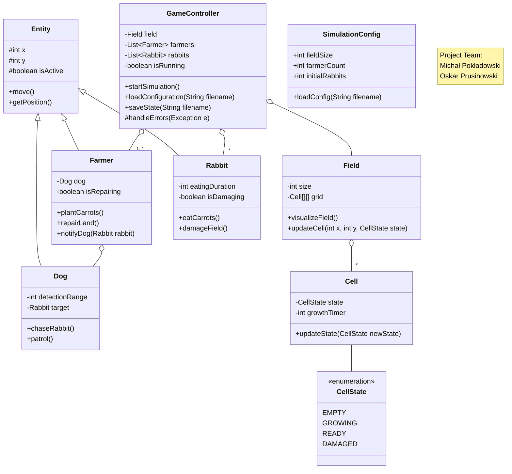

```mermaid
classDiagram
note "Project Team:
Michał Pokładowski
Oskar Prusinowski"

    class GameController {
        -Field field
        -List~Farmer~ farmers
        -List~Rabbit~ rabbits
        -boolean isRunning
        +startSimulation()
        +loadConfiguration(String filename)
        +saveState(String filename)
        #handleErrors(Exception e)
    }

    class Field {
        -int size
        -Cell[][] grid
        +visualizeField()
        +updateCell(int x, int y, CellState state)
    }

    class Entity {
        #int x
        #int y
        #boolean isActive
        +move()
        +getPosition()
    }

    class Farmer {
        -Dog dog
        -boolean isRepairing
        +plantCarrots()
        +repairLand()
        +notifyDog(Rabbit rabbit)
    }

    class Dog {
        -int detectionRange
        -Rabbit target
        +chaseRabbit()
        +patrol()
    }

    class Rabbit {
        -int eatingDuration
        -boolean isDamaging
        +eatCarrots()
        +damageField()
    }

    class Cell {
        -CellState state
        -int growthTimer
        +updateState(CellState newState)
    }

    class CellState {
        <<enumeration>>
        EMPTY
        GROWING
        READY
        DAMAGED
    }

    class SimulationConfig {
        +int fieldSize
        +int farmerCount
        +int initialRabbits
        +loadConfig(String filename)
    }

    GameController o-- Field
    GameController o-- "1..*" Farmer
    GameController o-- "*" Rabbit
    Farmer o-- Dog
    Field o-- "*" Cell
    Cell -- CellState
    Entity <|-- Farmer
    Entity <|-- Dog
    Entity <|-- Rabbit
```
